# Paella Va!
### Documento de diseño de videojuego
Autores:
* Elena Robert Núñez, elenrobe@ucm.es
* Javier Cano Salcedo, jacano01@ucm.es
* José Miguel Villacañas, josemv03@ucm.es
* Marta Croche Trigo, mcroche@ucm.es
* Pablo Arredondo Nowak, pablarre@ucm.es
* Rocío Sanchez-Horcajuelo Lopez, rocisa08@ucm.es
* Víctor Manuel Estremera Herranz, vestre01@ucm.es
* Rodrigo Cabello Hernández, rodricab@ucm.es
* Alfonso Rodulfo Guío, arodulfo@ucm.es
* Diego Rol Sánchez, drol@ucm.es

<table>
<tr>
    <td colspan = "2"> <b>Descripción:</b> Una cocinera y un camarero aúnan sus fuerzas para sacar adelante su restaurante de paellas. </td>
        
    
</tr>
<tr>
    <td> <b>Géneros:</b> Simulación, Cooperativo </td>
    <td> <b>Modos:</b> 2 jugadores </td>
        
    
</tr>
<tr>
    <td> <b>PEGI: </b> 
        7
 </td>
    <td> <b>Plataformas:</b> PC. </td>
        
    
</tr>
<tr>
    <td> <b>Cantidades:</b>

Personajes: 2

 </td>
    <td> <b>Hitos:</b>

0. Propuesta del concepto: 2 de febrero de 2022
1. Arquitectura base: 23 de febrero de 2022
2. Ciclo de juego: 23 de marzo de 2022
3. Release: 4 de mayo de 2022

 </td>
        
    
</tr>

</table>

### Tabla de contenidos

1. [Relato breve](#relatobreve)
2. [Mecánica](#mecanica)
3. [Controles](#controles)
4. [Dinámica](#dinamica)
5. [Estética](#estetica)
6. [Contenido](#contenido)
    1. [Personajes](#personajes)
    2. [Ingredientes](#ingredientes)
    3. [Paellas](#paellas)
    4. [Restaurante](#restaurante)
    5. [Efectos de sonido](#sonido)
7. [UI](#ui)
8. [UML](#uml)
9. [Plataformas de gestión y comunicación](#comunicacion)
10. [QA](#qa)
11. [Plan de pruebas](#planpruebas)
12. [Referencias y contexto cultural](#referencias)

## 1. Relato breve y parcial de una partida típica 
Dos jugadores se conectan a una red local, usando Hamachi, ZeroTier o similar; abren el juego y comienzan una partida.

Uno de ellos (host) abre un restaurante y espera al otro jugador (client), que busca un restaurante en la dirección IP del primero. Ahora el client espera a que el host comience la partida.

El host es la cocinera y comienza en la cocina, y el client es el camarero y comienza en el comedor.

En el comedor, los clientes entran al restaurante y el camarero lleva los grupos a las mesas y apunta su pedido en la libreta de comandas. Las comandas aparecerán en la lista de comandas en la parte superior de la pantalla.

En la cocina, la cocinera empieza a preparar las paellas que ha pedido el camarero en las comandas. Coloca la paella en la encimera, le echa el arroz, recoge los ingredientes de la cinta, los procesa, los echa a la paella, la coloca en un fogón, y saca la paella en el momento preciso para que salga más rica. Selecciona cuál es la comanda que está haciendo para decirle al camarero a qué mesa tiene que llevar la paella cuando la coloque en la ventanilla.

El camarero lleva las paellas a la mesa indicada y espera a que los clientes terminen. Entonces los echa amablemente por la puerta y recoge las paellas sucias y las mete al lavavajillas. Cuando salgan, la cocinera podría cogerlas y reutilizarlas para las siguientes paellas.

Este ciclo continuará hasta que se acabe la jornada. Momento en el que se pasa a una pantalla intermedia en la que los jugadores reciben las reviews que han dejado los clientes y serán mejores cuanto más clientes hayan atendido y mejor lo hayan hecho. Ahora el client espera a que el host continúe y comienzan la siguiente jornada.

Cuando acabe la última jornada, la pareja conseguirá una puntuación final, y obtendrán un final, que varía entre el cierre del restaurante y ganar una estrella Michelín. El host terminará la partida y ambos jugadores se desconectarán y volverán al menú principal.

## 2. Mecánicas 
### **Restaurante**
El juego se basa en un cooperativo online de dos personas llevan un restaurante. Ambos jugadores eligen su rol al principio de la partida, esto se traduce en que si el cocinero realiza las acciones que típicamente están empeñadas y viceversa, habrá penalización. 

El rol de camarero está diseñado para encargarse de gestionar el comedor y el de cocinera que debería gestionar  la cocina. A la vista de la cocina será totalmente diferente a la del comedor. Cocina y comedor estarán conectados tanto por una puerta, por donde se podrá cambiar de localización, como por una ventanilla, desde la cual ir sacando los platos que vayan saliendo.

### **Jugadores**
El movimiento será continuo en 8 direcciones, con aceleración y velocidad máxima. Tardará 300 ms en llegar a la velocidad máxima y 150 ms en pararse desde la velocidad máxima.

Los jugadores podrán coger y transportar en su cabeza objetos y personajes.

* Para recoger un ingrediente de la cinta, el jugador deberá interactuar estando al lado de la posición donde se encuentra en ese momento el ingrediente.

* Para recoger un grupo de comensales, el jugador deberá estar posicionado adyacente a este.

* Para dejar un grupo de comensales en una mesa, deberá estar al lado de la mesa donde quiera sentarles.

Los jugadores solo podrán llevar una paellera, un ingrediente o un grupo de comensales encima de la cabeza a la vez.

Los jugadores podrán interactuar con los diferentes objetos de la cocina y el comedor, siempre y cuando estén lo suficientemente cerca de estos. Se interactúa principalmente con la tecla ‘e’.

* Para dejar un ingrediente, paella, etc, debemos acercarnos al mueble en cuestión y pulsar la tecla ‘e’.

* Para procesar un ingrediente, deberemos acercarnos a la tabla de procesados con un ingrediente y pulsar la tecla ‘e’.

* Para limpiar una paella, deberemos acercarnos al lavavajillas con una paella sucia y pulsar la tecla ‘e’.

* Para dejar una paella, tendremos que acercarnos a un fogón e interactuar con él con la tecla ‘e’. Sin embargo, no podremos colocar la paella si esta no contiene como mínimo el arroz, o si se encuentra sucia.

La cámara será fija y ocupará todo el comedor o cocina, pero habrá una interpolación lineal horizontal que permita a la cámara alternar su posición dependiendo de la habitación en la que te encuentres.

### **Cocina:**
La cocina ocupará un total de 18 x 9 tiles.

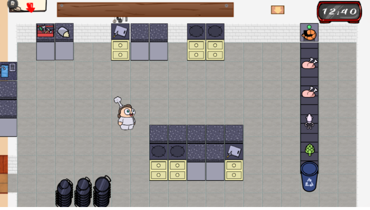

La cocina contará con:
* **Cinta Transportadora:**
    * Por ella aparecerán ingredientes cada 2 segundos. 
    * Los ingredientes ocupan 1 tile.
    * Todos los ingredientes aparecerán con la misma probabilidad. 
    * No se pueden devolver ingredientes a la cinta transportadora. 
    * Los ingredientes aparecerán al inicio de la cinta y se desactivan al final de esta.
    * El final de la cinta también podrá ser utilizada como papelera por el jugador:
        * Si el jugador lleva consigo un ingrediente no deseado, podrá desecharlo por aquí (el sprite de la basura queda resaltado). 
        * En el caso de que lleve una paellera (que no esté limpia), podrá tirarla también por la basura, en cuyo caso pasará a llevar una paellera sucia (tendrá que limpiarla en el lavavajillas). 

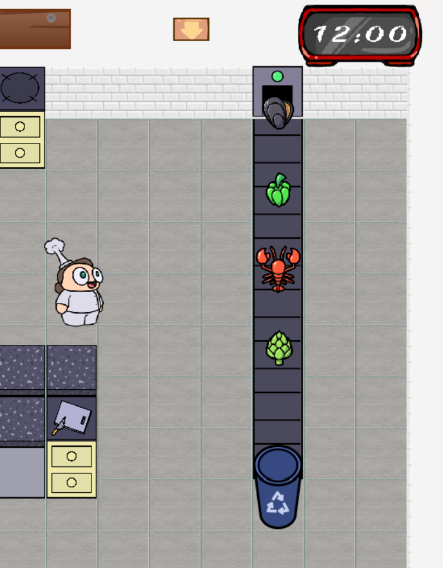

 
* **Basura:** 
    * Ocupa 1 tile.
    * Si el jugador lleva consigo un ingrediente no deseado, podrá desecharlo por aquí (el sprite de la basura queda resaltado). 
    * En el caso de que lleve una paellera (que no esté limpia), podrá tirarla también por la basura, en cuyo caso pasará a llevar una paellera sucia (tendrá que limpiarla en el lavavajillas). 

* **Pila de Paellas:**
    * Ocupará 3 tiles (uno por cada tipo de tamaño de paellera). 
    * Encima de cada uno de los tiles aparecerá el número de paelleras que quedan de ese tipo. 
    * El jugador podrá coger una paellera o apilar una en su montón correspondiente (siempre y cuando esté limpia) según le convenga. 

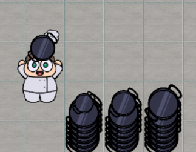

* **Tabla de Procesamiento:** 
    * Ocupará un tile.
    * En ella se colocarán los ingredientes para ser procesados (trocear los el pollo, limpiar los mejillones…). 
    * Para poder echar los ingredientes en la paellera será obligatorio procesarlos previamente. 
    * El jugador tardará 2 segundos en procesar todos los ingredientes.
    * El jugador podrá detener el procesamiento una vez empezado.
    * Cuando el jugador termine de procesar el alimento, este se quedará procesado en la tabla a la espera de que el jugador lo coja.

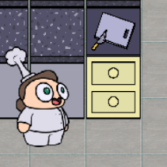
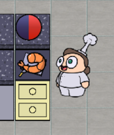
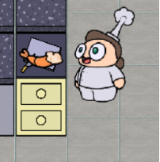

* **Fogones:**
    * Cada fogón ocupa un tile.
    * Cuando el jugador ponga una paellera en un fogón desocupado las llamas comenzarán a salir.
    * Solo se pueden poner paellas con arroz en los fogones.

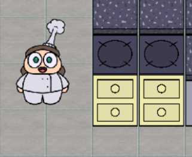
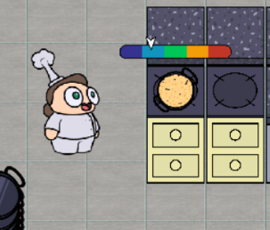

* **Lavavajillas:**
    * Ocupa 1 tile.
    * Lugar donde se limpian las paelleras sucias. 
    * Las paelleras no se limpian a la vez. Se limpiarán en el orden en el que hayan sido introducidas.
    * Cuando el camarero interactúa con este, recogerá la primera paellera que se limpió, si interactúa otra vez, recogerá la siguiente… (como si fuera una cola). 
    * Se podrán tirar paelleras sucias desde la cocina y desde el comedor.
    * No se pueden tirar paelleras limpias ni enteras al lavavajillas. 

    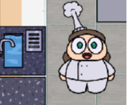
    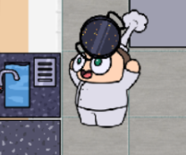
    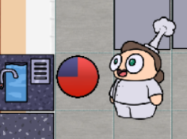

* **“Puerta” (espacio entre cocina y comedor):**
    * Ocupa 1 tile.
    * Los jugadores la pueden atravesar caminando.
    * Si te encuentras en la cocina aparecerás delante de la puerta del comedor y viceversa.
    * Si llevas algo encima de la cabeza seguirás llevándolo en la cabeza cuando traspases la puerta.

    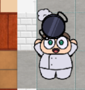
    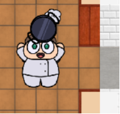

### **Paellas:**

La paella podrá tener de 0 a 3 ingredientes, independientemente de que los clientes solo puedan pedir un máximo de tres ingredientes por paella.

* **El proceso de preparación de la paella:**

    1. Colocar una paellera limpia encima de la encimera.
    2. Colocar el arroz.
    3. Recoger el ingrediente.
    4. Procesar el ingrediente.
    5. Echar el ingrediente en la paella.
    6. … Repetir desde el paso 3 hasta concluir con los ingredientes pedidos por el cliente.
    7. Poner la paella en los fogones. En este momento aparecerá la barra de cocción.
    8. Esperar a que la paella se cocine.
    9. Quitar la paella de los fogones (una vez sacada la paella de los fogones esta no se podrá volver a calentar)

        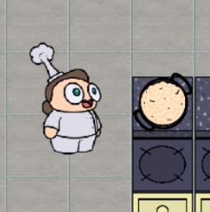
        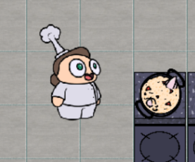
        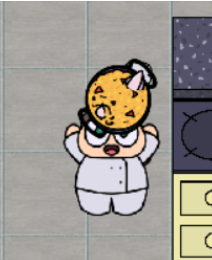

* **Equivocarse de Paella:**
    * Si la paella pedida no coincide con la entregada, el cliente se la comerá igualmente, pero la puntuación bajará considerablemente dependiendo de lo que falle.

|Diferencia de la original (niv. tam.)|2 veces + grande|1 vez + grande|   | 1 vez + pequeña| 2 veces + pequeña |
|---|---|---|---|---|---|
|**Tamaño**| -1  |  -0.5 ||  -1 | -2  |
|**Ingrediente Sobrante**||  -0.1 (por cada ingrediente) |
|**Ingrediente Ausente**||  -0.25 (por cada ingrediente) |

* **Barra de cocción:**
    * Durante el tiempo de cocinado de la paella la barra subirá. 
    * Si el cocinero consigue sacar la paella en el momento justo el restaurante conseguirá más puntos a la hora de vender el plato.
    * En contrapartida, perderá puntos si el plato sale crudo o muy hecho.

    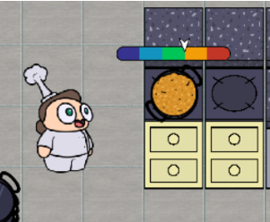
    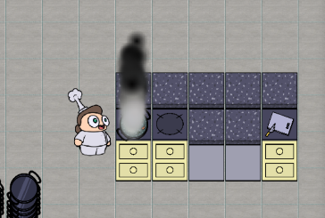

* **Estado de la paellera:**
    * Durante el ciclo de vida de la paella esta tendrá aspectos:
        * Limpia
        * Con comida
        * Con comida (comida al 50%)
        * Sucia (comida al 100%)

* **Tamaños de Paelleras:**
    * Las paelleras, las cuales se recogen de las pilas de paellas, serán limitadas en número dependiendo de su tamaño y dependiendo de la jornada.
    * Se entiende que un grupo de comensales pedirá un encargo cuyo sumatorio de tamaños es igual que el número de comensales en el grupo.

        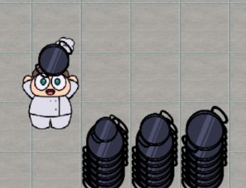

* **Tiempo para Comer la Paella:**
    * Los comensales tardarán el mismo tiempo para comerse las paellas.
    * Los comensales empezarán a comerse las paellas cuando todas las que hayan pedido lleguen a mesa.
    * El tiempo que tardan los comensales en comerse la paella no depende del tamaño de la misma (se entiende que una paella grande se la comerían entre tres comensales).

* **Puntuación Final de la Paella:**
**Punt. Final = (Sum(paellas) / N paellas) * ((Tolerancia + 50) / 100)**

* **Tiempo para Comer la Paella:**
    * El tiempo será siempre de 30 segundos.
    * El tiempo que tardan los comensales en comerse la paella no depende del tamaño de la misma (se entiende que una paella grande se la comerían entre tres comensales).

* **Puntuación Final de la Paella:**

    * Punt. Final = (Punt. Cocción - Penalización Temperatura) * Tamaño Paellera
    * Si (Punt. Cocción - Penalización Temperatura) es un número negativo, el multiplicador de tamaño de la paellera no se aplicará.

### **Comedor:**
El comedor ocupará 20 x 11 tiles. Tanto el comedor como la cocina comparten varias mesas, un lavavajillas y la “puerta” que conecta, los cuales ya han sido explicados en la parte de Cocina.

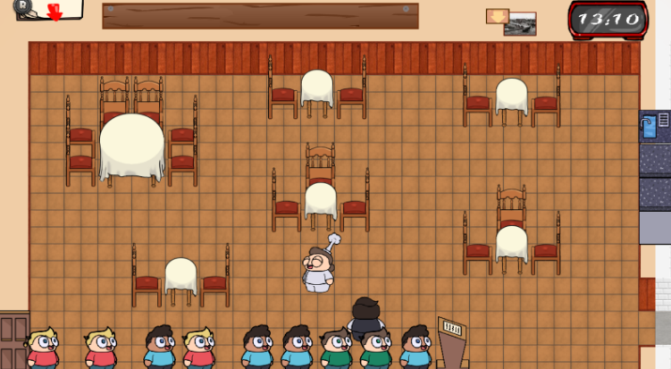

El comedor contará con:
**Puerta para Clientes:** se sitúa en la pared inferior izquierda de la sala. Por ella entrarán los nuevos comensales. Tiene el tamaño de 2 tiles.

**Fila de comensales:** se situará en la parte inferior izquierda de la sala, justo  delante de la puerta. Será de dimensión X (ancho) * 2 (alto). Si la cola está llena, no entrarán más comensales por la puerta. 

**Mesas:** estas podrán ocupar 1, 2 o 4 tiles. Cuando el camarero traiga la paella a la mesa esta ocupará un tile (independientemente del tamaño de la paellera). Por ejemplo, en una mesa de dos tiles podrá haber como máximo dos paelleras. 

**Sillas:** estarán asociadas a las mesas (no puede existir una silla sin una mesa delante). El camarero se encargará de coger a los comensales y sentarlos en la mesa que crea conveniente. Ocupan 1 tile. En una mesa solamente podrá sentarse un único grupo de comensales independientemente de si hay sillas de sobra para otro grupo en esa misma mesa.

### **Comensales:**

Los comensales irán en grupos de 1 a 6 personas. Cada grupo estará separado del siguiente por medio tile para remarcar quien pertenece a cada grupo.

* Cada grupo de comensales tendrá un nivel de tolerancia:
    * Empieza al 100%. 
    * El nivel de tolerancia irá bajando poco a poco cuando el grupo se encuentre en estado de espera (mientras esperan en la cola, esperan para pedir o esperan la cuenta).
    * El jugador podrá ver el nivel de tolerancia de los comensales siempre que quiera, pasando el ratón por encima del grupo.
    * El nivel de tolerancia será representado por un bocadillo con un emoticono.

* Ciclo de vida típico de un grupo de comensales:

    * Entran por la puerta y se ponen al final de la cola (espera: OFF)
    * Esperan en la cola (espera: ON)
    * El camarero coge al grupo de comensales y los lleva en la cabeza hasta su mesa (espera: ON)
    * Esperan en la mesa a que el camarero les tome nota (espera: ON)
    * El camarero les toma nota (espera: ON). Durante este proceso aparecerá un bocadillo encima del grupo de comensales con un icono que hará referencia a una característica de la/las paella/paellas que quieran comer, el icono cambiará cada 0,5 segundos. Estos iconos saldrán en el siguiente orden:
        * Tamaño de la paella (S, M, L)
        * Ingrediente nº 1
        * Ingrediente nº 2
        * Ingrediente nº 3
        * Siguiente paella (vuelta al punto 1) en caso de haber pedido más de una
        * Check de confirmación
        * Una vez se completa un ciclo vuelve a empezar.
    *  Esperan en la mesa a que el camarero les traiga la comida (espera: ON)
    * El camarero les trae la paella:
        * Si no quedan paellas por traer → espera: OFF
        * Si quedan paellas por traer → espera: ON
    * Comensales comiendo (no empezarán a comer hasta que les hayas traído todas las paellas) (espera: OFF)
    * Todos los comensales del grupo han terminado de comer y esperan la cuenta (espera: ON)
    * El camarero los toma la cuenta, cogiendo al grupo de comensales y los llevándolos hasta la puerta (espera: ON)
    * Si se llega a completar el ciclo de vida típico la puntuación a la puntuación de la paella se le multiplicará el nivel de tolerancia final, como se ha explicado en la fórmula anterior. Esta suma se realizará cuando el cliente lleve a los clientes a la puerta. 

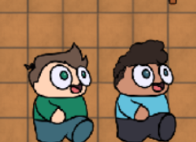

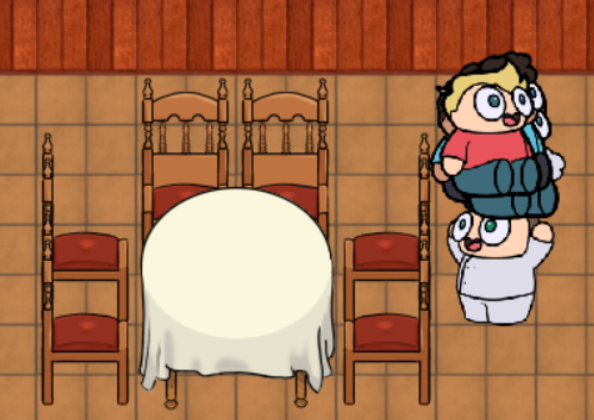
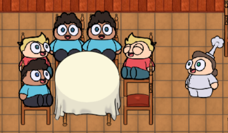

Esta puntuación por servicio se sumará a la puntuación por la paella. Estas puntuaciones se sumarán en el momento que los clientes salgan por la puerta.

### **Interacciones (con los comensales):**
* **Fila de comensales:**
    * El camarero podrá coger a un grupo de comensales de la cola y pasará a llevarlo encima en la cabeza, siempre y cuando no lleve ya algo en la cabeza.
    * Cuando el camarero coja a un grupo de comensales, los comensales se quedarán en la cola pero en modo “fantasma (opacidad bajada)”.
    * El camarero podrá interactuar con las mesas posibles, para sentar a los comensales en las sillas.
    * Al ponerlos en sus sillas, los sprites fantasma de la cola desaparecerán.
    * Los comensales que se encontrasen detrás del grupo fantasma comenzarán a caminar hasta que no queden huecos en la cola.
    * No podrás seleccionar a un grupo de comensales que esté caminando.  
    * El camarero podrá coger a cualquier grupo de la cola (es decir, tiene total libertad de “colar” a gente siempre que hayan dejado de caminar).
    * El camarero podrá echar a un grupo de comensales del restaurante si lleva al grupo de comensales interactuando con la puerta si el grupo estaba en la cola o había terminado de comer.
    * El jugador podrá devolver al grupo de comensales a la cola interactuando con el grupo fantasma (lugar donde se encontraban antes de interactuar).
    * Echar a un grupo de comensales en la cola puntuará como 0 a una nueva paella.

* **Mesas:**
    * Si los clientes están a la espera de que les tomen el pedido, al colisionar con las mesas, comenzarán a contarle al camarero lo que quieren (descrito anteriormente).
    * Si, durante este estado, el camarero se aleja, los clientes dejarán de contarle el pedido al camarero (dejarán de salir bocadillos).
    * Si, durante este estado, el camarero vuelve a interactuar con la mesa, los clientes volverán a decirle el pedido desde el principio.
    * Si están a la espera de la comida y el camarero lleva una paella recién hecha en la cabeza, podrá elegir en qué tile poner la paellera, siempre y cuando el tile no esté ocupado, sino se colocará en el siguiente más cercano. 
    * Si ya han terminado de comer, podrás volver a coger al grupo de comensales, para llevarlos encima hasta la puerta.
    * Cuando hayas “acompañado” al grupo de comensales a la puerta, las mesas quedarán sin limpiar, el camarero podrá interactuar con estas para recoger las paelleras sucias.

### **Jornadas:**

El juego se desarrolla durante 5 jornadas distintas, cada uno de ellos  se jugará en un restaurante completamente distinto al anterior, cambiando la disposición general de todos los muebles  de las 2 salas (cocina y comedor) así como su posición en el mapa global. Los diseños se encuentran en el juego en el siguiente orden: 

#### **JORNADA 1**

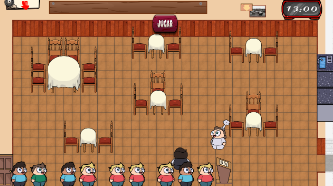
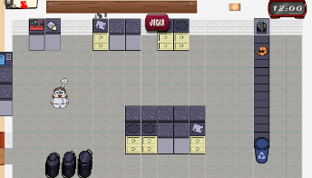

El comedor se encuentra en  sala izquierda del mapa , los clientes entraran por la zona inferior izquierda de la sala , sentar a todos los grupos será sencillo ya que todas la mesas están accesibles directamente .En la pared derecha se encuentra el acceso a al cocina y la ventanilla , la acción más perjudicada en esta sala será servir las paellas a las mesas de la parte izquierda de la sala.

La cocina se encuentra en la sala derecha del mapa la cinta de alimentos está en la esquina superior derecha y es fácilmente accesible ya que está contra la pared. Muy cerca de la cinta encontramos  la isla de encimeras con los fogones y las tablas.

#### **JORNADA 2**

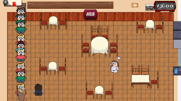
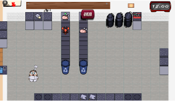

El comedor se encuentra en la sala izquierda del mapa y las mesas disponen de modo que el camarero debe rodear antes de poder acceder a la ventanilla y a la puerta que comunica con la  cocina.

La cocina se encuentra en la sala derecha y encontramos 2 cintas de alimentos accesibles en todas las direcciones  , en las paredes laterales hay encimeras para proporcionar espacios de almacenamiento .

#### **JORNADA 3**

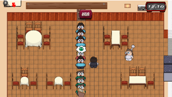
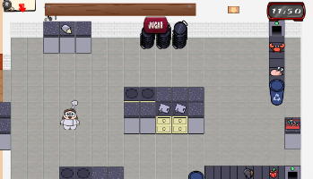

El comedor se encuentra en la sala izquierda del mapa, la ventanilla está al lado de la puerta y tiene mesas cercanas que serán fáciles de servir pero otras que están lejos.  Los clientes entrarán por la parte central superior del restaurante hasta llegar al cartel.

La cocina se encuentra en la sala derecha del mapa  con dos cintas de alimentos en la parte superior derecha de la habitación y otra en la parte inferior derecha parcialmente, con una isla de muebles en el medio y las pilas de paella cerca de la misma.

#### **JORNADA 4**

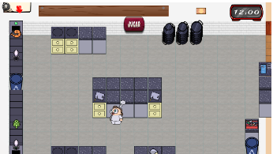
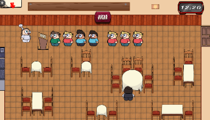

El comedor  se encuentra en la sala derecha del mapa, a diferencia de los comedores del resto de jornadas . Con las mesas situadas debajo de la fila de clientes. Estos entrarán al restaurante por la esquina superior derecha.

La cocina  se encuentra en la sala izquierda del mapa , Esta tiene dos cintas en la parte izquierda del mapa, con distinta orientación, una isla de encimeras con dos tablas para dejar ingredientes y paellas, y encontramos 4 fogones divididos de dos en dos.

#### **JORNADA 5**

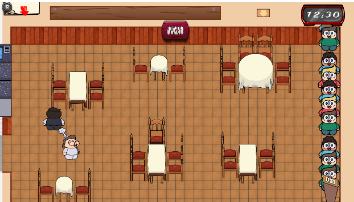

El comedor se encuentra en la sala derecha del mapa,como el anterior, este contiene varias mesas  y esta vez los clientes harán cola en la parte derecha del mapa, un mapa más complicado para servir y sentar clientes de manera rápida.

La cocina se encuentra en la sala izquierda del mapa , similar a la cocina anterior, pero con una distribución algo distinta pero más que suficiente para preparar muchas paellas.

### **Tutorial:**

El tutorial es un apartado extra dentro del juego, en el que enseñamos a los jugadores las mecánicas y dinámicas principales de nuestro juego. Sin embargo, no obligamos a ningún jugador a completarlo porque se haría aburrido tener que completar el tutorial cada vez que alguien entre al juego. Aunque, no por eso,  es menos útil, cumple todas las funcionalidades de un tutorial. Para acceder tenemos un botón en el menú principal el cual nos llevará al tutorial. Este se basa en una máquina de estados, en la que el jugador se verá “obligado” a realizar las acciones que se le mandan en los diálogos. Aunque si que tiene cierta libertad, pero haga lo que haga al final lo único que podrá hacer será lo correcto. 

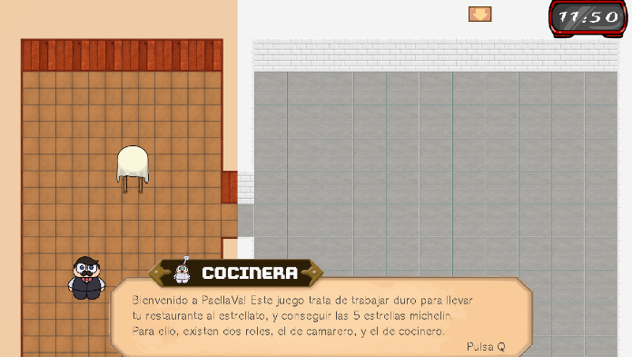

Este se basa en una serie de diálogos entre acciones, en los cuales te indican cual será tu siguiente misión dentro del restaurante, por ejemplo, al colocar una paellera vacía en la mesa, aparecerá un diálogo diciendo que sólo puedes colocar arroz y que no podrás colocar ingredientes si no hay arroz. El jugador deberá seguir todos los pasos indicados en los diálogos hasta llegar al final, y en caso de haber leído todos los diálogos, cortos y explicativos, habrá aprendido a jugar de ambos roles.

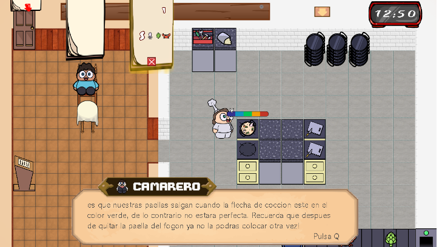

Para llevar a cabo esto, los muebles van apareciendo de forma progresiva, para que el jugador no pueda anticiparse a las misiones que tiene que realizar, por lo que no podrá cocinar una paella, hasta que no haya preparado la paella que ha pedido el cliente.

De esta forma, podemos enseñar al jugador, el orden principal de hacer las cosas, aunque luego él pueda hacerlo a su gusto.

### **Comandas:**
* Los jugadores podrán escribir comandas siempre que quieran. 
* Al seleccionar el botón de Nueva Comanada (+) se desplegará un nuevo menú (libreta). 
* La libreta ocupa la mitad inferior de la interfaz del camarero.
* La comanda contará con varios botones con los que podrá podrá seleccionar:
    * El número de la mesa (el número se escribirá por teclado)
    * Apuntar una nueva paella
    * Tamaño de la nueva paella
    * Los ingredientes que llevará
    * Cancelar comanda
    * Descartar la comanda (se crea una comanda en blanco)
    * Finalizar comanda
* Al añadir un nuevo ingrediente en la comanda todos los botones de los ingredientes se reorganizarán aleatoriamente.
* Si el jugador se equivoca al escribir la comanda y quiere corregirla, tendrá que descartarla y volver a escribir una nueva.
* El jugador puede moverse mientras escribe una comanda.

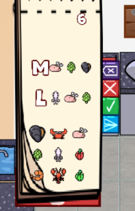
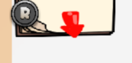
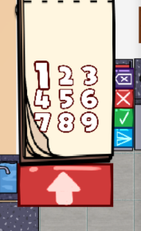

* Cuando el jugador le dé al botón de finalizar comanda, esta se moverá a la parte superior de la pantalla de ambos jugadores, pero tendrá otro formato.
* Se podrán acumular un máximo de 6 comandas encima de la pantalla.
* En las comandas aparecerá el tamaño de cada paella con sus ingredientes correspondientes debajo, además del número de la mesa.
* A la derecha de cada botón e ingrediente habrá un botón para tacharlos.
* Si se tacha la paella directamente, se tachan automáticamente todos los ingredientes asociados a esta.
* Tachar en la comanda es algo opcional que los jugadores pueden utilizar.
* También habrá un botón para eliminar la comanda.
* Si los jugadores eliminan una comanda, no la podrán volver a recuperar.
* En el caso de que en pantalla haya más comandas que el número máximo que se pueden acumular, aparecerá un número en la esquina superior derecha con las comandas extra que aún le quedan por atender los jugadores.
* Cuando los jugadores eliminen una comanda, aparecerá en pantalla la siguiente acumulada.

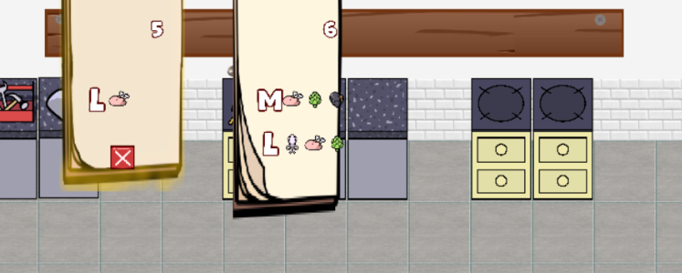

### **Eventos del Juego:**

A lo largo de la partida surgirán eventos durante las jornadas de forma aleatoria para añadir espontaneidad y algo de “chispa” al gameplay. En el juego encontraremos los siguientes eventos:

* Ingredientes falsos: En la cinta de alimentos aparecerán elementos que no están

* Los muebles se rompen: Cada cierto tiempo los muebles tendrán la probabilidad de romperse. Adicionalmente, se incluirá un nuevo mueble: la caja de herramientas. En cada restaurante habrá una y se situará en la cocina. Si interactúas con ella te dará una llave inglesa, la cual podrás utilizar para arreglar muebles. La llave inglesa también se podrá colocar en las encimeras. Los muebles que se podrán romper serán:
    * Lavavajillas: no puedes meter paellas en ella.
    * Mesa de procesado: no podrás procesar ingredientes.
    * Cinta: dejarán de salir ingredientes.
    * Fogón: no podrás poner paellas.

## 3. Controles 

| Acción                     | Teclado          |
|----------------------------|------------------|
| Moverse                    |       WASD       |
| Interactuar*               |  Click izquierdo |
| Escribir número de la mesa | Teclado numérico |

Interactuar* incluye:
* Coger ingrediente
* Procesar ingrediente en la tabla de procesado
* Echar ingrediente procesado  / arroz a la paella
* Coger paellera
* Dejar paellera
* Seleccionar grupo de comensales
* Seleccionar mesa
* Seleccionar puerta
* Echar paella / ingrediente a la basura
* Echar paellera al lavavajillas
* Botones de las interfaces
* Coger grupo de comensales
* Echar grupo de comensales por la puerta

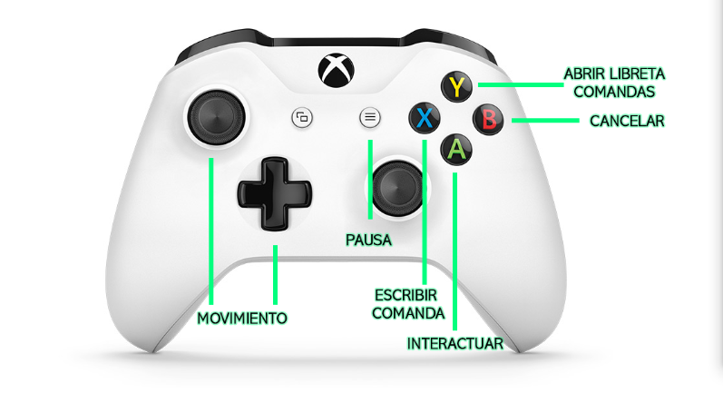
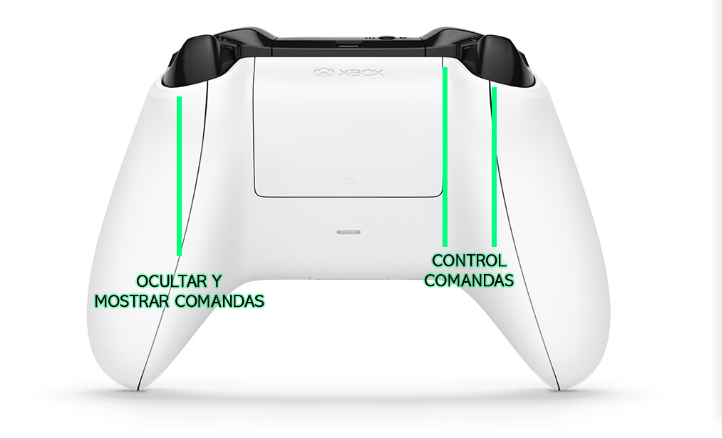

## 4. Dinámica 

El tiempo de la jornada de trabajo (una partida) será de 12:00 a 6:00. Cada hora en el jugo es 1 minuto en la vida real, por lo que una partida durará  6 minutos. 

El objetivo del juego es conseguir la mayor puntuación posible. Como se ha explicado anteriormente, consigues más puntuación cuanto mejor cocines las paellas y más rápido atiendas a los clientes. En cambio, la perderás si te equivocas de platos, cocinas mal las paellas o si tardas mucho en atender a los clientes. Al final de la partida aparecerá la puntuación obtenida.

El juego busca la interacción entre los jugadores para decidir la estrategia con la cual abordar la partida. Ya sea que ambos jugadores vayan de la mano por cocina y comedor, ya sea una postura más tradicional con roles separados, ya sea una combinación de ambas posturas, etc.

En general, se busca recompensar la buena comunicación y, por lo tanto, buena organización, entre jugadores, que serán aquellos que consigan sacar el restaurante adelante y conseguir una mayor puntuación. 

## 5. Estética 

La estética general del juego está basada en un arte cartoon vectorizada, con colores pastel y una gama de colores animada. En definitiva, una estética poco agresiva que promueve el aspecto para todos los públicos del juego.

Habrá dos personajes, el camarero y el cocinero, cada uno de ellos con una apariencia diferente pero dentro de la misma estética.

El diseño de sonido consta de una gama de sonidos realistas, que representan cada una de las acciones realizadas por el jugador.

## 6. Contenido 

### Personajes: 

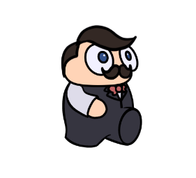

### Ingredientes: 

| Nombre         | Normal       | Procesado   | En Paella   | 
|----------------|--------------|-------------|-------------|
| Gambas         |              | 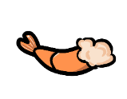            |             |             
| Calamares      |              | 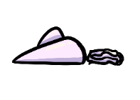            |             |             
| Mejillones     | 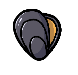             | 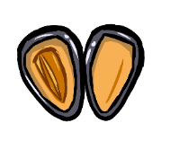            |             |             
| Pimiento Verde | 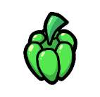             |             |             |             
| Pimiento Rojo  | 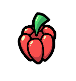             | 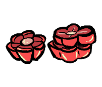            |             |             
| Pollo          | 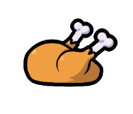             | 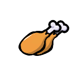            |             |              
| Cangrejo       |              |             |             |              
| Langosta       |              |             |             |               
| Alcachofa      |              |             |             |                        

### Restaurante: 
Sprites ligados al entorno de juego:

De la cocina:

Del comedor:
* Pared
* Esquina Pared
* Losa 1
* Losa 2
* Ventanilla
* Borde Ventanilla
* Puerta (comensales)
* Puerta (jugadores)
* Valla Terciopelo
* Mesa (1 x 1)
* Mesa (2 x 1)
* Mesa (2 x 2)
* Silla
* Lavavajillas

### Efectos de sonido: 

* Nuevo grupo de comensales entrando por la puerta (campanita)
* Abrir puerta del comedor / cocina
* Clientes caminando
* Jugadores caminando
* Coger comensales
* Dejar comensales
* Comensales comiendo
* Dejar paella en una mesa (ventanilla / mesas normales)
* Grito del número de la mesa (uno por cada mesa)
* Meter paellera sucia en el lavavajillas
* Sacar paellera del lavavajillas
* Ruido del lavavajillas
* Sacar a clientes (sonido de caja registradora)
* Echar a clientes de la cola (?)
* Sonido fogón encendiéndose
* Sonido de paella friéndose
* Ruido cinta transportadora
* Sonido mientras procesas un ingrediente (cuchillo troceando)
* Sonido cuando echas un ingrediente a la paella
* Sonido cuando tiras algo a la papelera
* Sonido para cuando sacas una pallera de los fogones
(podría ser el mismo que cuando enciendes un fogón)
* Sonido cuando abres la libreta de comandas
* Sonido cuando escribes una nueva comanda
* Sonido cuando tachas un ingredientes / paella de la comanda
* Sonido cuando eliminas una comanda
* Un sonido distinto dependiendo de la puntuación obtenida
* Sonido para los botones de la interfaz

## 7. UI 

* Menú inicio
    * 

* Interfaz
    * 
    * 
    * 

* Menú puntuación final
    * 
## 8. UML 

## 9. Comunicación 
Tenemos cuenta de Twitter en la que hacemos memes, revisiones semanales de como va en Spaces. Hemos usado Github tanto para la gestión de versiones como gestor de desarrollo y Discord para la comunicación interna del equipo y con los testers.

## 10. QA 
Se desarrollaron pruebas de testeo en las que contamos con 7 usuarios distintos.
Recogimos los siguientes datos:

* Ritmo del Juego 
Pedimos  a los testers que analizasen la velocidad de varios elementos del juego.

Es muy llamativo el conses respecto a lo rápido que funcionaba gran parte del juego.Algo que estresaba a los usuarios y a lo que eramos completamente ajenos ya que habiamos trabajado progresivamente con los elemento y estabamos acostumbrados al accelerado ritmo de juego.

* Ciclo de Juego 
Saber como funcionan todos los elementos del juego al unisono también es muy importante y pedimos a los testers que se  centrasen en visualizar el juego como un entrenimiento casual para loq eu incialmente habiamos propuesto jornadas de  10 minutos.

Fue agradable descubrir que nadie se aburrió durante la jornada ni consideró el juego repetitivo.

 * Apredizaje de mecánicas
 Al ser un juego muy similar a otros titúlos como el Overcooked suponiamos que la mayoria de las mecánicas resultarian intuitivas y los testers comprenderian el juego rapidamente.Esto era cierto para el movimiento o la interaccion con objetos pero para otras cosas:
 
 Era muy evidente que ciertos aspectos mecánicos no se apreciaban correctamente y enfatizamos su presencia en el tutorial.
 
 
 * Feedback subjetivo 
 A parte de preguntas limitadas que ofrecian datos cuantificables en las estadisticas que se muestran en los parrafos anteriores  pregúntamos libremente a los testers acerca de  dificultades que hubieran podido tener a lo largo de su sesión .La fiabilidad de estas declaraciones es cuestionable ya que la gente no es muy propensa a  admitir cuando se  equivoca asi que usamos esta informacion para contrastar las observaciones de las personas de nuestro equipo de  desarrollo que supervisaban a los testers.
 
 * Observaciones
  A partir de la informacion libre enviada por los testers y las observaciones realizadas pudimos concluir que algunos cambios serian necesarios:
  (se usan comillas para emplear palabras textuales de lso testers)
  +"Añadir ingredientes a la paella es raro. Tener que poner siempre el arroz primero te quita libertad. También tener que cocinar todos los ingredientes a la vez te resta de poder autogestionarte."

* "Las mesas deberían venir enumeradas ya."( el numero de mesa ha causado bastante confusión)

* Las pilas de paelleras podrian tener un cartelito abajo para indicar el tamaño

* Literalmente TODO va demasiado rapido especialmente  las paellas se concinan muy muy muy rapido y no te da tiempo a hacer otra cosa , los clientes empiezan desde el minuto 0 a  venir a  full molaria que al principio hubiera menos y que fuera acelerando y en general menos clientes por minuto se agradeceria.

* La puerta entre salon y cocina realmente no es una puerta , es un cuadrado blanco y noo se ve bien molaria poner una flechita en el suelo o algo indicando que puedes andar por ahi hacia otra habitacion

* El signo de prohibido como , paella solo de arroz confunde a  bastante gente.

* Ui de muebles mal colocaba o solapada: cuando hay 2 fogones juntos si colocas una paella en cada uno la barra de cocción de una tapara a la  otra , en un mapa donde las tablas de  procesados están abajo del todo y el circulo rojo este de progreso no se ve.
 
## 11. Plan de pruebas 
* En Paella Va!, los jugadores deberán hacer uso de los controles y de la estrategia para llevar un restaurante de la manera más positiva posible, de manera que todos los comensales queden satisfechos.

* MENÚS DEL JUEGO

Se desea probar el correcto funcionamiento del menú de lobby, menú principal, menú de pausa, y menú de ajustes del juego.

Para comenzar se abrirá el menú principal, donde deberá haber tres botones, uno para comenzar partida, otro para ir al menú de ajustes y otro para salir del juego. Primero de todo comprueba que al entrar en este menú suena una canción.
Una vez comprobado esto comprueba que al pulsar el botón de “Salir” se sale del juego y emite un sonido al tocar el botón.

Ahora reinicia el juego y comprueba que al pulsar en el botón de “Ajustes” suena el mismo sonido que en el botón de salir y en este caso nos lleva a un escena con los ajustes del juego.
Una vez en esta escena, encontramos cuatro posibles interacciones, para empezar, comprueba que puedes mover los sliders con el emoticono de paella mientras tienes el ratón encima del icono de paella, mantienes pulsado el clic izquierdo y te deslizas a los lados. Comprueba que con el slider de arriba la música disminuye si avanzas hacia la izquierda y aumenta si avanzas hacia la derecha. Y comprueba qué ocurre lo mismo con el slider de abajo pero con los sonidos, es decir, bajalo al tope y dale al botón de la cruz arriba a la derecha, este botón debería llevarte al menú principal y emitir un sonido, pero si has bajado el slider a tope no debería de sonar. Ahora vuelve a entrar al menú de ajustes, sube el sonido y vuelve a pulsar el botón de la cruz, comprueba que ahora si emite un sonido.

Por último, vuelve al menú de ajustes y pulsa el botón que hay en la parte inferior en el centro, este botón debería colocar el juego en pantalla completa. 
Una vez comprobado todo el menú de ajustes, vuelve al menú principal y dale al botón “Comenzar”, este debería de emitir un sonido similar al resto de botones y debería llevarnos al menú de lobby.

En este menú deberíamos de encontrar dos botones, uno para ser el host de la partida (“ABRIR RESTAURANTE”) y otro para unirnos a la partida de otra persona (“BUSCAR RESTAURANTE”).
A continuación, vamos a comprobar que podemos abrir el menú de pausa, para ello pulsa la tecla “ESC” y comprueba que todo lo que había en escena se ha parado y han aparecido tres botones en pantalla., el botón de “Resume”, para volver a la partida, el botón de “Ajustes” y el botón “Exit”.

Para empezar prueba que el botón de “Resume” nos devuelve a la partida y esta avanza con normalidad. Ahora vuelve al menú de pausa y comprueba que al pulsar el botón de “Ajustes” nos lleva a un menú similar al visto anteriormente. Por último, pulsa el botón “Exit” y comprueba que nos lleve al menú principal. Todos estos botones deberían de emitir el mismo sonido que los anteriores.

* MECÁNICAS BÁSICAS

Se desea probar el correcto funcionamiento del jugador y de las mecánicas principales del mismo y su interacción con los elementos del escenario.

En primer lugar, prueba a moverte con las teclas WASD para comprobar que nos podemos mover en todas las direcciones.

A continuación, acércate a la cinta de ingredientes y prueba a colocarte en frente de un ingrediente y cogerlo. Prueba a dejarlo en la cinta otra vez y verás que no se puede. La cinta debería de estar emitiendo un sonido constante.

Después vuelve a coger otro ingrediente y prueba a dejarlo en cualquier encimera para comprobar que se coloca, sin embargo, intenta colocarlo en el fogón o lavavajillas y verás que no se puede.
Prueba a coger una paellera vacía y a dejarla en cualquier encimera, verás que puedes, lo mismo con el arroz.

A continuación, ve a la cola de clientes y prueba a coger un grupo de clientes. A continuación intenta dejarlo en el mismo sitio donde los has cogido, verás que es posible. Sin embargo, no podrás colocarlos en cualquier sitio, solo en las mesas y en la posición que ocupaban en la cola.
Por último, comprueba que el personaje es capaz de colisionar con todos los objetos del juego, sin que traspase ninguno, eso si, comprueba que existe un orden de capas, es decir, el personaje si pasa por detrás de una mesa se verá la mesa primero pero si pasa por delante se verá el personaje.

* TABLA  DE PROCESADOS

Se desea probar el correcto funcionamiento de las tablas de procesado con respecto a todos los ingredientes.

Empecemos por coger un ingrediente de la cinta y colocarlo en la tabla de procesados, debemos comprobar que aparece un círculo que indica lo que le falta para procesarse y lo que lleva procesado. Una vez colocado el ingrediente comprueba que puedes escuchar un sonido mientras se procesa, ahora vuelve a cogerlo aunque no se haya terminado de procesar y comprueba que el sonido se para.

Ahora comprueba que al volver a colocar el ingrediente en la tabla de procesados se reinicia el tiempo para procesarse, lo que significa que el círculo debería de empezar desde el principio.
Una vez colocado el ingrediente, comprueba que el círculo se completa correctamente y que una vez llega al final el ingrediente cambia de sprite, el círculo desaparece y el sonido para. Y por último, coge el ingrediente procesado y comprueba que no puedes volver a dejarlo en la tabla si ya está procesado.

Ahora, tendrás que repetir estos últimos pasos con cada uno de los ingredientes del juego, para comprobar que el funcionamiento es el mismo en todos y que ninguno tiene un bug en ese aspecto.
Sin embargo, comprobar que el arroz aunque sea un ingrediente no se puede colocar en la tabla de procesados.

Una vez probado que se puede introducir ingredientes no procesados a la tabla y los ingredientes ya procesados no se pueden volver a introducir ni se puede meter el arroz, vamos a comprobar que no se puede introducir ningún otro elemento del escenario que no sean ingredientes sin procesar.
Para ello vamos a empezar por comprobar que las paelleras, tanto limpia como sucia como con comida no se puede meter, para ello te hemos dejado cada una de ellas en la escena para que puedas probarlo con las tres.

Ahora, dirígete a la cola de clientes, coge un grupo y comprueba que no lo puedes colocar en la tabla de procesados y con esto ya habremos comprobado todo.

* GRUPO DE CLIENTES 

Se desea probar el correcto funcionamiento de los grupos de clientes que hay en la cola del restaurante y su interacción con los elementos del escenario.

Para comenzar, prueba a coger un grupo de clientes y dejarlos en una mesa, verás que sólo puedes colocar a dicho grupo de clientes en una mesa que tenga más sillas que clientes en el grupo.
A continuación, prueba a coger otro grupo de clientes e intenta dejarlo en la mesa en la que has dejado al anterior grupo de clientes, verás que esto no es posible, aunque haya espacio suficiente en la mesa como para colocar al grupo que has cogido.

Ya que no has podido dejarlos en esa mesa, prueba a dejarlos en la puerta del restaurante para comprobar que puedes echar a los clientes de la cola si no tienes espacio suficiente para colocarlos o por gusto.

Vale, ahora vamos a probar los distintos estados de los clientes. Prueba a coger un grupo mientras están caminando hacia el final de la cola, observarás que no puedes coger un grupo de clientes mientras están en estado “CAMINANDO”. Una vez estos llegan al final de la cola, pasan al estado “COLA” donde ya pueden ser recogidos y dejados en una mesa, echados del restaurante, o se pueden quedar ahí infinitamente. 

Antes de nada, prueba a colocar el ratón encima de un grupo, y observarás que aparece un emoticono que representa la tolerancia del grupo, una vez un grupo llega al estado “COLA”, la tolerancia empieza a bajar. Espera un rato con el ratón encima de un grupo en “COLA” para comprobar que la tolerancia baja y los emoticonos cambian.

Después, vamos a pasar a testear a los comensales en el estado “PIDIENDO”, para llegar a dicho estado, coge un grupo de clientes y siéntalos en una mesa en la que puedan comer. Ahora, prueba que al acercarte a la mesa de los clientes, estos empiezan a decirte lo que quieren (mediante emoticonos encima de la mesa), y prueba que si te alejas, estos dejan de decírtelo. Además, si te alejas y vuelves a acercarte, estos empezarán desde el principio.

Los comensales no van a parar de decirte su pedido mientras que estés cerca de la mesa y no le hayas entregado ninguna paella. Una vez les hayas entregado una paella, estos pasarán al estado de “ESPERANDO” , en caso de que hayan pedido más de una paella y estén esperando a que entregues todas, o al estado “COMIENDO”, en caso de que ya estén todas entregadas. 

Hay dos posibles casos, vamos a probar para cada uno:
En caso de que haya pedido más de una paella el grupo, vamos a comprobar el estado “ESPERANDO” , prueba a dejar una paella hecha de las que hay en escena en la mesa, y comprueba que los clientes dejan de mostrar su pedido encima de la mesa, en ese momento el grupo ha pasado al estado “ESPERANDO” , y en este estado, la tolerancia también baja conforme pasa el tiempo, así que coloca el ratón encima del grupo y comprueba lo mismo que anteriormente, que la tolerancia baja y que los emoticonos cambian. Además , comprueba que no puedes quitarle las paellas que ya has entregado. Una vez comprobado esto ya podemos darle el resto de paellas que hayan pedido para que cambien de estado.

En caso de que te hayan pedido una sola paella o ya hayas entregado todas las paellas que han pedido, vamos a comprobar el estado “COMIENDO” , coloca las paellas necesarias que hay en escena en la mesa, ahora pasarán al estado “COMIENDO” y empezarán a comerse la paella, comprueba que cada poco tiempo el sprite de la paella que hay en la mesa va cambiando, hasta acabar con una paella sucia. Comprueba también que no puedes quitarles las paellas de la mesa.  

Una vez los clientes han terminado de comer, pasarán al estado “CUENTA”, donde se harán los cálculos necesarios para obtener la puntuación que deja este grupo. Ahora, deberás coger al grupo de clientes y dejarlos en la misma mesa, verás que es posible. Ahora intenta dejarlos en cualquier otro sitio, verás que no es posible. Por último, prueba a dejarlos en la puerta del restaurante, comprueba que desaparecen de la mesa , es decir, los has echado del restaurante porque ya han terminado de comer. 

Sin haber quitado las paellas sucias de la mesa, comprueba que no puedes dejar otro grupo en dicha mesa hasta que no esté limpia, para ello ,coge las paellas sucias de las mesa y prueba a dejarlas en las encimeras , de esta manera quedará la mesa limpia y volverá a ser útil.

* LAVAVAJILLAS

Se desea probar el correcto funcionamiento del lavavajillas y sus diversas interacciones con las paellas y el resto de elementos del escenario.

Empezaremos por comprobar que una paella limpia o con ingredientes no pueden ser lavadas.
Empieza por dirigirte a la cocina del restaurante y coge una paella limpia. Trata de introducirla en el lavavajillas y comprueba que no se puede. 

A continuación, deposita la paella en una de las encimeras, coge arroz y añádelo a la paella. Coge la paella y de nuevo, trata de meterla en el lavavajillas y comprueba que no es posible tampoco.

Lleva la paella a la papelera, vacía de ingredientes la paella para que su estado sea sucio. Dirígete de nuevo al lavavajillas e introduce la paella en el lavavajillas y comprueba que pasados 3 segundos la paella se habrá limpiado y será posible sacarla ya limpia (con el mismo aspecto que tenía antes de añadirle ingredientes). Además, debería de haber aparecido un círculo que te indica el tiempo que falta para que se lave una paella.

Ahora, prueba a meter otra paella sucia al lavavajillas, y comprueba que no puedes quitar la paella mientras se está lavando, sin embargo, una vez el círculo se haya completado y ya se haya lavado la paella, si podrás cogerla.

Una vez probado que sólo se puede introducir una paella sucia (ni limpia ni con ingredientes), pasaremos a probar que no se puede introducir ninguna otra cosa en el lavavajillas.
Para ello, coge un ingrediente de la cinta transportadora y trata de introducirlo, sin procesar, en el lavavajillas, lo cual no debe de ser posible. Repite lo mismo pero tratando de introducir un ingrediente procesado en el lavavajillas esta vez.

Coge arroz de la bolsa de arroz y trata de introducirlo en el lavavajillas, observa que no es posible.
Coge un grupo de clientes y trata de introducirlo en el lavavajillas, observa que no es posible.

* PAPELERA

Se desea probar el correcto funcionamiento de la papelera y su correcta interacción con el arroz, los ingredientes y paellas.

Empezaremos por coger un ingrediente de la cinta transportadora y lo tiraremos a la papelera, observa cómo desaparece de tus manos.
A continuación, coge otro ingrediente y procésalo, introdúcelo en la papelera y observa que también desaparece. 

Para concluir con los ingredientes coge arroz de la bolsa de arroz e introdúcelo también en la papelera, observa que como el resto de ingredientes desaparece.
Para seguir, coge una paella limpia y trata de introducirla en la papelera, no debería ocurrir nada en absoluto , se queda como una paella limpia. A continuación, deposita la paella en una encimera y añádele arroz. Coge de nuevo la paella, interactúa con la papelera y comprueba que ,en este caso, la paella pasa de tener contenido a estar sucia. 

Comprueba que si interactúas con la papelera mientras llevas una paella sucia, tampoco debería de pasar nada, se queda como está, sucia.
Por último, coge un grupo de clientes y de nuevo introduce el grupo en la papelera. Comprueba que no es posible.

* COMANDAS

Se desea probar el correcto funcionamiento de las comandas y sus botones, así como la interacción entre el jugador y ellas.

Para comenzar, en la parte superior izquierda de la pantalla, verás que hay un pequeño botón con un lápiz, este hace referencia a la libreta de comandas, prueba a abrirlo y cerrarlo haciendo clic sobre ese botón. 
Ahora, comprueba que cua
ndo abres la libreta de comandas para hacer una nueva, lo primero que aparecen son botones para elegir el número de mesa que está haciendo este pedido, elige el número de mesa y verás que en la comanda aparece el número de mesa que has elegido en la parte superior derecha.

A continuación, una vez elegido el número de mesa, empezamos a apuntar las paellas, para ello deben de haber aparecido 3 botones que hacen referencia al tamaño de la paella que se va a apuntar, “S”, “M” o “L”. Elige el tamaño de la paella y verás que debajo del número de mesa a la izquierda, aparece el tamaño de la paella que hemos elegido.

Una vez elegido el tamaño de la paella, observarás que han aparecido muchos botones, cada uno con emoticono de un ingrediente, por ello procederemos a añadir los ingredientes pedidos por los clientes en la comanda (el arroz se da por hecho que lo tienen todas las paellas aunque no tengan ingredientes). Pulsa un ingrediente y observa que se coloca a la derecha del tamaño de la paella. Además , el orden en el que estaban todos los botones ha tenido que cambiar por completo, para dar más dificultad.

Las paellas pueden tener solo el arroz, o tener hasta tres ingredientes, por lo que cada vez que pulsemos un ingrediente se colocará a la derecha del anteriormente pulsado. Una vez finalizado el pedido de una paella, podemos realizar varias operaciones. A la derecha de lo que es la libreta , podemos ver cuatro botones. Con el de más arriba podemos podremos borrar lo último que hayamos apuntado, comprobar que si apuntas un ingrediente y pulsas el botón, este ingrediente desaparece.

Vuelve a hacer un pedido como quieras y pulsar el botón contiguo al anteriormente nombrado, el que tiene una cruz roja, este lo que hace es desechar la comanda que hayamos apuntado, antes de comprobar nada, apunta una paella y dale al botón del tick verde, este lo que hace es completar el pedido de una paella y empezar a pedir otra nueva para la misma mesa, comprueba que cuando lo pulsas aparecen los botones del tamaño de la paella y cuando vuelves a apuntar se apunta de la misma manera pero debajo de la paella anterior. Una vez apuntado dos paellas, prueba a darle al botón con la cruz roja, y verás que debería de borrar todo lo que hayamos apuntado. 
Por último, crea una comanda a tu gusto, y vamos a probar el botón situado más abajo, una vez hayas creado la comanda deseada, pulsa a probar este botón y comprueba que se coloca a la derecha de la libreta de comandas. Si pulsamos este botón con una comanda vacía, se coloca a la derecha una comanda vacía. 

Conforme se van apuntando comandas, las primeras que se han apuntado van moviéndose hacia la derecha, y las nuevas aparecen a la derecha de la libreta de comandas. Prueba a crear varias comandas y ver que las más viejas se mueven hacia la derecha de la pantalla, mientras que las nuevas más a la izquierda.

Por último pero no menos importante, una vez has terminado una comanda y la has enviado a la parte derecha de la pantalla, aparece un botón igual que la cruz roja en la parte inferior en el medio, comprueba que si pulsas ese botón desaparece la comanda. 
Además, en caso de haber más de una comanda en pantalla, si borras las que se encuentran más a la izquierda, comprueba que las comandas que haya por la derecha de la que acabas de borrar, se mueven una posición hacia la izquierda.

*  PREPARACIÓN Y COCINADO DE PAELLAS

Se desea probar el correcto funcionamiento de la creación de paellas así como su estado de cocción.

Para empezar, vamos a coger una de las paelleras limpias que hemos dejado en la escena. Comprueba que puedes colocarla sin problema en las encimeras. Una vez colocada, coge un ingrediente de la cinta de ingredientes, y comprueba que no puedes colocarlo en la paellera limpia.
Ahora lleva el ingrediente a procesar, y comprueba que una vez procesado tampoco podrás introducirlo a la paellera, esto es por que para hacer una paella lo primero de todo tiene que haber arroz.

Por ello, dirígete a la bolsa de arroz y coge arroz, ahora llévalo a la paellera limpia y comprueba que sí que podemos colocarlo ya que el arroz desaparece de nuestras manos y el sprite de la paella cambia.
Antes de nada comprueba que no puedes volver a colocar arroz en una paella con arroz.
Ahora , coge otro ingrediente de la cinta, y comprueba que no puedes introducirlo en la paella ya que este todavía no está procesado. 
Ahora, coge el ingrediente que habías procesado con anterioridad y comprueba que si que puedes colocarlo en la paella.

A continuación, realiza estos dos últimos pasos hasta haber metido tres ingredientes en la paella, y que ninguno de ellos haya podido ser un ingrediente sin procesar.
Una vez realizado esto, comprueba que no se puede meter ni un ingrediente procesado ni uno sin procesar, esto viene a ser ya que las paellas tienen un máximo de tres ingredientes por paella.
Ahora vamos a pasar a cocinar una paella, para empezar, comprueba que una paellera limpia no la puedes meter en el fogón, ya que no tiene sentido. Además, coge una paellera sucia y verás que tampoco se puede meter al fogón, ya que tampoco tiene sentido.

Ahora coge una paella limpia y agregale arroz, comprueba que solo con el arroz una paella ya puede cocinarse. 
Una vez metas la paella en el fogón, comprueba que aparece una barra encima de ella que indica lo hecha que está, comprueba que conforme va pasando el tiempo la flecha que hay encima de la barra se va moviendo hacia la derecha. 
Espera un tiempo y comprueba que dicha flecha no se pasa del final de la barra, una vez llega al final se queda ahí.

Comprueba que conforme va pasando el tiempo de cocción, va cambiando el sprite de la paella y por último comprueba que una vez que retiras una paella del fogón, ya no puedes volver a meterla a cocinar.

## 12. Referencias y contexto cultural 

* Pesadilla en la cocina
* Overcooked
