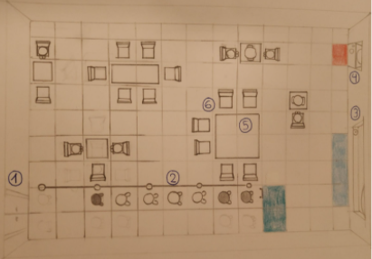
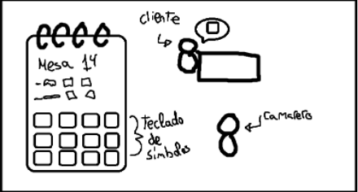
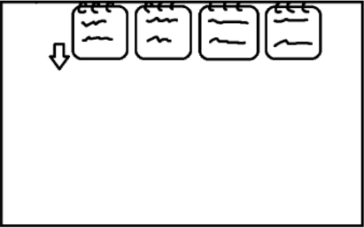

# Paellas Rodriguez’s
### Documento de diseño de videojuego
Autores:
* Elena Robert Núñez, elenrobe@ucm.es
* Javier Cano Salcedo, jacano01@ucm.es
* José Miguel Villacañas, josemv03@ucm.es
* Marta Croche Trigo, mcroche@ucm.es
* Pablo Arredondo Nowak, pablarre@ucm.es
* Rocío Sanchez-Horcajuelo Lopez, rocisa08@ucm.es
* Víctor Manuel Estremera Herranz, vestre01@ucm.es
* Rodrigo Cabello Hernández, rodricab@ucm.es
* Alfonso Rodulfo Guío, arodulfo@ucm.es
* Diego Rol Sánchez, drol@ucm.es

<table>
<tr>
    <td colspan = "2"> <b>Descripción:</b> Una cocinera y un camarero aúnan sus fuerzas para sacar adelante su restaurante de paellas. </td>
        
    
</tr>
<tr>
    <td> <b>Géneros:</b> Simulación, Cooperativo </td>
    <td> <b>Modos:</b> 2 jugadores </td>
        
    
</tr>
<tr>
    <td> <b>PEGI: </b> 
        7
 </td>
    <td> <b>Plataformas:</b> PC. </td>
        
    
</tr>
<tr>
    <td> <b>Cantidades:</b>

Personajes: 2

 </td>
    <td> <b>Hitos:</b>

0. Propuesta del concepto: 2 de febrero de 2022
1. Arquitectura base: 23 de febrero de 2022
2. Ciclo de juego: 23 de marzo de 2022
3. Release: 4 de mayo de 2022

 </td>
        
    
</tr>

</table>

### Tabla de contenidos

1. [Relato breve](#relatobreve)
2. [Mecánica](#mecanica)
3. [Controles](#controles)
4. [Dinámica](#dinamica)
5. [Estética](#estetica)
6. [Contenido](#contenido)
    1. [Personajes](#personajes)
    2. [Ingredientes](#ingredientes)
    3. [Paellas](#paellas)
    4. [Restaurante](#restaurante)
    5. [Efectos de sonido](#sonido)
7. [UI](#ui)
8. [UML](#uml)
9. [Plataformas de gestión y comunicación](#comunicacion)
10. [QA](#qa)
11. [Referencias y contexto cultural](#referencias)

## 1. Relato breve y parcial de una partida típica 
Dos jugadores se conectan a una red local, usando Hamachi, ZeroTier o similar; abren el juego y comienzan una partida.

Uno de ellos (host) abre un restaurante y espera al otro jugador (client), que busca un restaurante en la dirección IP del primero. Ahora el client espera a que el host comience la partida.

El host es la cocinera y comienza en la cocina, y el client es el camarero y comienza en el comedor.

En el comedor, los clientes entran al restaurante y el camarero lleva los grupos a las mesas y apunta su pedido en la libreta de comandas. Las comandas aparecerán en la lista de comandas en la parte superior de la pantalla.

En la cocina, la cocinera empieza a preparar las paellas que ha pedido el camarero en las comandas. Coloca la paella en la encimera, le echa el arroz, recoge los ingredientes de la cinta, los procesa, los echa a la paella, la coloca en un fogón, y saca la paella en el momento preciso para que salga más rica. Selecciona cuál es la comanda que está haciendo para decirle al camarero a qué mesa tiene que llevar la paella cuando la coloque en la ventanilla.

El camarero lleva las paellas a la mesa indicada y espera a que los clientes terminen. Entonces los echa amablemente por la puerta y recoge las paellas sucias y las mete al lavavajillas. Cuando salgan, la cocinera podría cogerlas y reutilizarlas para las siguientes paellas.

Este ciclo continuará hasta que se acabe la jornada. Momento en el que se pasa a una pantalla intermedia en la que los jugadores reciben las reviews que han dejado los clientes y serán mejores cuanto más clientes hayan atendido y mejor lo hayan hecho. Ahora el client espera a que el host continúe y comienzan la siguiente jornada.

Cuando acabe la última jornada, la pareja conseguirá una puntuación final, y obtendrán un final, que varía entre el cierre del restaurante y ganar una estrella Michelín. El host terminará la partida y ambos jugadores se desconectarán y volverán al menú principal.

## 2. Mecánicas 
### **Restaurante**
El juego se basa en un cooperativo online de dos personas llevan un restaurante. Ambos jugadores eligen su rol al principio de la partida, esto se traduce en que si el cocinero realiza las acciones que típicamente están empeñadas y viceversa, habrá penalización. 

El rol de camarero está diseñado para encargarse de gestionar el comedor y el de cocinera que debería gestionar  la cocina. A la vista de la cocina será totalmente diferente a la del comedor. Cocina y comedor estarán conectados tanto por una puerta, por donde se podrá cambiar de localización, como por una ventanilla, desde la cual ir sacando los platos que vayan saliendo.

### **Jugadores**
El movimiento será continuo en 8 direcciones, con aceleración y velocidad máxima. Tardará 300 ms en llegar a la velocidad máxima y 150 ms en pararse desde la velocidad máxima.

Los jugadores podrán coger y transportar en su cabeza objetos y personajes.

* Para recoger un ingrediente de la cinta, el jugador deberá interactuar estando al lado de la posición donde se encuentra en ese momento el ingrediente.

* Para recoger un grupo de comensales, el jugador deberá estar posicionado adyacente a este.

* Para dejar un grupo de comensales en una mesa, deberá estar al lado de la mesa donde quiera sentarles.

Los jugadores solo podrán llevar una paellera, un ingrediente o un grupo de comensales encima de la cabeza a la vez.

Los jugadores podrán interactuar con los diferentes objetos de la cocina y el comedor, siempre y cuando estén lo suficientemente cerca de estos. Se interactúa principalmente con la tecla ‘e’.

* Para dejar un ingrediente, paella, etc, debemos acercarnos al mueble en cuestión y pulsar la tecla ‘e’.

* Para procesar un ingrediente, deberemos acercarnos a la tabla de procesados con un ingrediente y pulsar la tecla ‘e’.

* Para limpiar una paella, deberemos acercarnos al lavavajillas con una paella sucia y pulsar la tecla ‘e’.

* Para dejar una paella, tendremos que acercarnos a un fogón e interactuar con él con la tecla ‘e’. Sin embargo, no podremos colocar la paella si esta no contiene como mínimo el arroz, o si se encuentra sucia.

La cámara será fija y ocupará todo el comedor o cocina, pero habrá una interpolación lineal horizontal que permita a la cámara alternar su posición dependiendo de la habitación en la que te encuentres.

### **Cocina:**
La cocina ocupará un total de 18 x 9 tiles.

La cocina contará con:
* **Cinta Transportadora:**
    * Por ella aparecerán ingredientes cada 2 segundos. 
    * Los ingredientes ocupan 1 tile.
    * Todos los ingredientes aparecerán con la misma probabilidad. 
    * No se pueden devolver ingredientes a la cinta transportadora. 
    * Los ingredientes aparecerán al inicio de la cinta y se desactivan al final de esta.
    * El final de la cinta también podrá ser utilizada como papelera por el jugador:
        * Si el jugador lleva consigo un ingrediente no deseado, podrá desecharlo por aquí (el sprite de la basura queda resaltado). 
        * En el caso de que lleve una paellera (que no esté limpia), podrá tirarla también por la basura, en cuyo caso pasará a llevar una paellera sucia (tendrá que limpiarla en el lavavajillas). 

 
* **Basura:** 
    * Ocupa 1 tile.
    * Si el jugador lleva consigo un ingrediente no deseado, podrá desecharlo por aquí (el sprite de la basura queda resaltado). 
    * En el caso de que lleve una paellera (que no esté limpia), podrá tirarla también por la basura, en cuyo caso pasará a llevar una paellera sucia (tendrá que limpiarla en el lavavajillas). 

* **Pila de Paellas:** 
    * Ocupará 3 tiles (uno por cada tipo de tamaño de paellera). 
    * Encima de cada uno de los tiles aparecerá el número de paelleras que quedan de ese tipo. 
    * El jugador podrá coger una paellera o apilar una en su montón correspondiente (siempre y cuando esté limpia) según le convenga. 
    El tile correspondiente al tamaño de la paellera limpia quedará resaltado si el jugador pasa el ratón por encima. 
    * En el caso de que no lleve ningún objeto quedará resaltado el tile sobre el que se sitúe el ratón siempre.

* **Tabla de Procesamiento:** 
    * Ocupará 1 tile
    * En ella se procesarán los ingredientes para ser procesados (trocear los el pollo, limpiar los mejillones…). 
    * Para poder echar los ingredientes en la paellera será obligatorio procesarlos previamente. 
    * El jugador tardará 2 segundos en procesar todos los ingredientes.
    * El jugador no podrá detener el procesamiento una vez empezado.
    * Cuando el jugador termine de procesar el alimento, este pasará a llevarlo en la cabeza directamente.

* **Fogones:**
    * Cada fogón ocupa 1 tile.
    * Habrá 4 fogones.
    * Cuando el jugador ponga una paellera en un fogón desocupado, el arroz se pondrá directamente y las llamas comenzarán a salir.
    * Tras este proceso, el jugador podrá empezar a echarle ingredientes (procesados) a la paella.
    * Cuando el jugador deposita un ingrediente procesado en la paellera, este se consumirá y cambiará el aspecto de la paella. 
    * El fogón quedará resaltado cuando el cocinero lleve encima una paellera limpia. 
    * La paellera quedará resaltada cuando el jugador lleve un ingrediente procesado y cuando no lleve nada en la cabeza (en este caso el jugador cogerá la paella). 
    * En los casos contrarios no se podrá interactuar con los fogones / paelleras. 

* **Ventanilla:**
    * En la ventanilla caben un total de 3 paellas (por lo tanto ocupa 3 tiles de tamaño).
    * Se podrán depositar paellas recién hechas para que puedan ser recogidas desde el comedor.
    * Cuando el cocinero le envíe la paellera al cocinero, se abrirá un pequeño menú para indicar a qué mesa va dicha paella.
    * La paella enviada aparecerá con un bocadillo encima que indicará el número de la mesa. Este bocadillo durará 3 segundos hasta desvanecerse. También se escuchará un audio gritando el número de la mesa.
    * El tile de la ventanilla quedará resaltado si el jugador pasa el ratón por encima y tiene una paella recién hecha en la cabeza.
    * Desde el comedor, la paellera en ventanilla resaltará cuando el jugador pase el ratón por encima.

* **Lavavajillas:**
    * Ocupa 1 tile.
    * Lugar donde se limpian las paelleras sucias. 
    * Dependiendo de cómo de sucias estén, tardarán más en limpiarse. 
    * Las paelleras no se limpian a la vez. Se limpiarán en el orden en el que hayan sido introducidas.
    * Cuando el camarero interactúa con este, recogerá la primera paellera que se limpió, si interactúa otra vez, recogerá la siguiente… (como si fuera una cola). 
    * Se podrán tirar paelleras sucias desde la cocina y desde el comedor, pero solo se podrán sacar paelleras limpias desde la cocina.
    * Cuando se haya limpiado la paellera, aparecerá un bocadillo con su imagen (evidentemente, este bocadillo sólo se podrá ver desde la cocina).
    * No se pueden tirar paelleras limpias al lavavajillas. 
    * Si el jugador lleva una paellera que no esté limpia en la cabeza y pasa el ratón por encima, el lavavajillas resaltará.
    * Si el jugador no lleva nada en la cabeza, hay una paellera limpia por recoger y se encuentra en la cocina, el lavavajillas también resaltará.

* **Puerta:**
    * Ocupa 1 tile.
    * Los jugadores la pueden atravesar caminando.
    * Si te encuentras en la cocina aparecerás delante de la puerta del comedor y viceversa.
    * Si llevas algo encima de la cabeza seguirás llevándolo en la cabeza cuando traspases la puerta.

### **Paellas:**
* **El proceso de preparación de la paella:**

    1. Colocar una paellera limpia encima de los fogones (el arroz se colocará directamente). Tras este paso aparecerá la barra de cocción.
    2. Recoger ingrediente nº1 de la cinta y procesarlo
    3. Echar ingrediente procesado nº 1
    4. Recoger ingrediente nº2 de la cinta y procesarlo
    5. Echar ingrediente procesado nº 2
    6. Recoger ingrediente nº3 de la cinta y procesarlo
    7. Echar ingrediente procesado nº 3 (las paellas podrán tener de 0 a 3 ingredientes)
    8. Quitar la paella de los fogones (una vez sacada la paella de los fogones esta no se podrá volver a calentar)

* **Equivocarse de Paella:**
    * Si la paella pedida no coincide con la entregada, el cliente se la comerá igualmente, pero la puntuación bajará considerablemente dependiendo de lo que falle.

|Diferencia de la original (niv. tam.)|2 veces + grande|1 vez + grande|   | 1 vez + pequeña| 2 veces + pequeña |
|---|---|---|---|---|---|
|**Tamaño**| -1  |  -0.5 ||  -1 | -2  |
|**Ingrediente Sobrante**||  -0.1 (por cada ingrediente) |
|**Ingrediente Ausente**||  -0.25 (por cada ingrediente) |

* **Barra de cocción:**
    * Durante el tiempo de cocinado de la paella la barra subirá. 
    * Si el cocinero consigue sacar la paella en el momento justo el restaurante conseguirá más puntos a la hora de vender el plato.
    * En contrapartida, perderá puntos si el plato sale crudo o muy hecho.
    * Los tiempos están en segundos.
    * Si la paella llega a incomestible la barra dejará de subir.

| Tamaño Paella     | Cruda  | Bien    | Perfecto | Bien    | Quemada | Incomestible |
|-------------------|--------|---------|----------|---------|---------|--------------|
| Pequeña           | 0 - 14 | 14 - 20 | 21 - 24  | 25 - 31 | 32 - 42 |    >=43      |
| Mediana           | 0 - 18 | 19 - 25 | 26 - 29  | 30 - 36 | 37 - 47 |    >=48      |
| Grande            | 0 - 20 | 21 - 27 | 28 - 31  | 32 - 38 | 39 - 49 |    >=50      |
| **Punto cocción** | -0.5   |    0    | +0.5     |    0    | -0.5    |      -4      |

* **Temperatura de la paella:**
    * Una vez retirada la paella de los fuegos comenzará un temporizador interno para medir si la paella llega a la temperatura adecuada a mesa o, sin embargo, se ha quedado fría.
    * Si la paella se ha quedado fría bajará la puntuación final en proporción al tiempo que se haya quedado de más (Penalización por Temperatura).
    * Si la paella lleva recién hecha menos de 20s: 0
    * Si lleva más de 20s: Tiempo Extra * 0.05
    * Se entiende que el nivel de cocción es irrelevante al contador de la temperatura.

* **Estado de la paellera:**
    * Durante el ciclo de vida de la paella, la paellera tendrá aspectos y características diferentes (tiempo de lavado del lavavajillas).

| Estado                 | Tiempo Lavado Base (s) |
|------------------------|:----------------------:|
| Limpia                 |    No se puede meter   |
| Recién Hecha           |            8           |
| Comida (25%)           |            6           |
| Comida(50%)            |            5           |
| Comida(75%)            |            4           |
| Sucia (Comida al 100%) |            2           |

* **Tamaños de Paelleras:**
    * Del tamaño de la paellera depende tanto el tiempo de lavado de la misma, como de la puntuación final por la paella, actuando de multiplicador.
    * Además, las paelleras serán limitadas en número dependiendo de su tamaño.
    * Se entiende que:
    
|               | Pequeña | Mediana | Grande |
|---------------|:-------:|---------|--------|
| Multiplicador |    1    |    2    |    3   |
| Nº paellas    |    7    |    8    |    6   |

Tiempo Lavado = Tiempo Lavado Base * Tamaño Paella

Se entiende que un grupo de comensales no podrá pedir un encargo cuyo sumatorio de tamaños (multiplicador) sea mayor que el número de comensales en el grupo.

* **Tiempo para Comer la Paella:**
    * El tiempo será siempre de 30 segundos.
    * El tiempo que tardan los comensales en comerse la paella no depende del tamaño de la misma (se entiende que una paella grande se la comerían entre tres comensales).

* **Puntuación Final de la Paella:**

    * Punt. Final = (Punt. Cocción - Penalización Temperatura) * Tamaño Paellera
    * Si (Punt. Cocción - Penalización Temperatura) es un número negativo, el multiplicador de tamaño de la paellera no se aplicará.

### **Comedor:**
El comedor ocupará  16 x 12 tiles. Tanto el comedor como la cocina comparten la ventanilla (3), el lavavajillas (4) y la puerta que conecta , los cuales ya han sido explicados en la parte de Cocina.

El comedor contará con (el boceto actual no representa al 100% lo descrito aquí):
* **Puerta para Clientes:** se sitúa en la pared inferior izquierda de la sala. Por ella entrarán los nuevos comensales. Tiene el tamaño de 2 tiles.
* **Fila de comensales:** se situará en la parte inferior izquierda de la sala, justo  delante de la puerta. Será de dimensión X (ancho) * 2 (alto). Si la cola está llena, no entrarán más comensales por la puerta. Los clientes se acumularán en la parte superior de la fila.
* **Mesas:** estas podrán ocupar 1, 2 o 4 tiles. Cuando el camarero traiga la paella a la mesa esta ocupará un tile (independientemente del tamaño de la paellera). Por ejemplo, en una mesa de dos tiles podrá haber como máximo dos paelleras. 
* **Sillas:** estarán asociadas a las mesas (no puede existir una silla sin una mesa delante). En ellas se sentarán los comensales cuando el camarero dé la orden. Ocupan 1 tile. En una mesa solamente podrá sentarse un único grupo de comensales independientemente de si hay sillas de sobra para otro grupo en esa misma mesa.
* **Barrera de Terciopelo:** será del tamaño de la fila de comensales pero se situará 1 tile por encima de esta. Delimita el espacio entre la cola y el resto del comedor.

### **Comensales:**
Los comensales irán en grupos de 1 a 8 personas. Todos los comensales que pertenezcan al mismo grupo tendrán el mismo sprite (o sprites muy similares con los cuales el jugador entienda que pertenecen al mismo grupo). 

Cada grupo de comensales tendrá un **nivel de tolerancia:**
* Empieza al 100%. 
* El nivel de tolerancia irá bajando poco a poco cuando el grupo se encuentre en estado de espera. 
* El jugador podrá ver el nivel de tolerancia de los comensales siempre que quiera, pasando el ratón por encima del grupo (o de la mesa en la que están sentados). 
* El nivel de tolerancia será representado por un bocadillo con un emoticono.
* Cada grupo de comensales tendrá un factor de bajada de nivel de tolerancia distinto (aleatorio).
* Máximo: -0,5%/s
* Mínimo: -0,2%/s

Ciclo de vida típico de un grupo de comensales:
1. Entran por la puerta y se ponen al final de la cola (espera: OFF)
2. Esperan en la cola (espera: ON)
3. El camarero coge al grupo de comensales y los lleva en la cabeza hasta su mesa (espera: OFF)
4. Esperan en la mesa a que el camarero les tome nota (espera: ON)
5. El camarero les toma nota (espera: ON). Durante este proceso aparecerá un bocadillo encima del grupo de comensales con un icono que hará referencia a una característica de la/las paella/paellas que quieran comer, el icono cambiará cada 0,5 segundos. Estos iconos saldrán en el siguiente orden:
    1. Para cuántas persona es la paella (1 - 3)
    2. Ingrediente nº 1
    3. Ingrediente nº 2
    4. Ingrediente nº 3
    5. Siguiente paella (vuelta al punto 1)
    6. …
    7. Check de confirmación (pedido completado)
6. Esperan en la mesa a que el camarero les traiga la comida (espera: ON)
7. El camarero les trae la paella:
    1. Si no quedan paellas por traer → espera: OFF
    2. Si quedan paellas por traer → espera: ON
8. Comensales comiendo:
    1. Si están comiendo todos los comensales → espera: OFF
    2. Si algún comensal ya ha terminado de comer (existe, al menos una paella sin acabar) → espera: ON
9. Todos los comensales del grupo han terminado de comer y esperan la cuenta (espera: ON)
10. El camarero les toma la cuenta (espera: OFF)
11. El camarero coge al grupo de comensales y los lleva hasta la puerta (espera: OFF)

Si se llega a completar el ciclo de vida típico la puntuación podrá subir o bajar dependiendo de su nivel de tolerancia final:

| Tolerancia | Puntuación |
|------------|------------|
| >75        |     +1     |
| <=75 y >50 |    +0.5    |
| <=50 y >25 |     +0     |
| <=25 y >0  | -1         |

Esta puntuación por servicio se sumará a la puntuación por la paella. Estas puntuaciones se sumarán en el momento que los clientes salgan por la puerta.

### **Interacciones (con los comensales):**
* **Fila de comensales:**
    * El camarero podrá coger a un grupo de comensales de la cola y pasará a llevarlo encima en la cabeza, siempre y cuando no lleve ya algo en la cabeza (cuando pase el cursor por encima, el grupo de comensales resaltará).
    * Cuando el camarero coja a un grupo de comensales, los comensales se quedarán en la cola pero en modo “fantasma”.
    * Si el camarero lleva a un grupo de comensales consigo, las mesas posibles a las que puedan ir los comensales quedarán resaltadas (es decir, mesas no ocupadas, mesas con un número de sillas >= número de comensales del grupo y mesas sin ninguna paellera por recoger) .
    * El camarero podrá interactuar con las mesas posibles, para sentar a los comensales en las sillas.
    * Al ponerlos en sus sillas, los sprites fantasma de la cola desaparecerán.
    * Los comensales que se encontrasen detrás del grupo fantasma comenzarán a caminar hasta que no queden huecos en la cola.
    * No podrás seleccionar a un grupo de comensales que esté caminando.  
    * El camarero podrá coger a cualquier grupo de la cola (es decir, tiene total libertad de “colar” a gente).
    * El camarero tendrá libertad de echar a un grupo de comensales del restaurante si lleva al grupo de comensales interactuando con la puerta (la puerta quedará resaltada).
    * El jugador podrá devolver al grupo de comensales a la cola interactuando con el grupo fantasma (el grupo fantasma quedará resaltado).
    * Echar a un grupo de comensales en la cola tendrá una penalización de 0,5 puntos.

* **Mesas:**
    * En este caso el cocinero podrá interactuar con las mesas cuando colisione con alguna de las sillas asociadas a esta (o con la mesa misma).
    * Si los clientes están a la espera de que les tomen el pedido, al interactuar comenzarán a contarle al camarero lo que quieren (ciclo de vida de un grupo de comensales → apartado 6).
    * Si, durante este estado, el camarero se aleja, los clientes dejarán de contarle el pedido al camarero (dejarán de salir bocadillos).
    * Si, durante este estado, el camarero vuelve a interactuar con la mesa, los clientes volverán a decirle el pedido desde el principio.
    * Si, durante este estado, otro camarero interactúa con tu misma mesa, los clientes también volverán a repetir el pedido desde el principio. 
    * Si están a la espera de la comida (teniendo en cuenta que pueden estar comiendo, pero a la espera de más paellas) y el camarero lleva una paella recién hecha en la cabeza, podrá elegir en qué tile poner la paellera, siempre y cuando el tile no esté ocupado (el tile seleccionado quedará resaltado, siempre y cuando sea un tile válido). 
    * Si ya han terminado de comer, podrás volver a coger al grupo de comensales, para llevarlos encima hasta la puerta (los sprites resaltarán cuando pases el ratón por encima y la puerta, cuando cojas al grupo).
    * Cuando hayas “acompañado” al grupo de comensales a la puerta, las mesas quedarán sin limpiar, el camarero podrá interactuar con estas para recoger las paelleras sucias (las paellas resaltará cuando el jugador pase el ratón por encima).

### **Comandas:**
* Los jugadores podrán escribir comandas siempre que quieran. 
* Al seleccionar el botón de Nueva Comanada (+) se desplegará un nuevo menú (libreta). 
* La libreta ocupa la mitad inferior de la interfaz del camarero.
* La comanda contará con varios botones con los que podrá podrá seleccionar:
    * El número de la mesa (el número se escribirá por teclado)
    * Apuntar una nueva paella
    * Tamaño de la nueva paella
    * Los ingredientes que llevará
    * Cancelar comanda
    * Descartar la comanda (se crea una comanda en blanco)
    * Finalizar comanda
* Al añadir un nuevo ingrediente en la comanda todos los botones de los ingredientes se reorganizarán aleatoriamente.
* Si el jugador se equivoca al escribir la comanda y quiere corregirla, tendrá que descartarla y volver a escribir una nueva.
* El jugador puede moverse mientras escribe una comanda.

* Cuando el jugador le dé al botón de finalizar comanda, esta se moverá a la parte superior de la pantalla de ambos jugadores, pero tendrá otro formato.
* Se podrán acumular un máximo de 6 comandas encima de la pantalla.
* En las comandas aparecerá el tamaño de cada paella con sus ingredientes correspondientes debajo, además del número de la mesa.
* A la derecha de cada botón e ingrediente habrá un botón para tacharlos.
* Si se tacha la paella directamente, se tachan automáticamente todos los ingredientes asociados a esta.
* Tachar en la comanda es algo opcional que los jugadores pueden utilizar.
* También habrá un botón para eliminar la comanda.
* Si los jugadores eliminan una comanda, no la podrán volver a recuperar.
* En el caso de que en pantalla haya más comandas que el número máximo que se pueden acumular, aparecerá un número en la esquina superior derecha con las comandas extra que aún le quedan por atender los jugadores.
* Cuando los jugadores eliminen una comanda, aparecerá en pantalla la siguiente acumulada.

## 3. Controles 

| Acción                     | Teclado          |
|----------------------------|------------------|
| Moverse                    |       WASD       |
| Interactuar*               |  Click izquierdo |
| Escribir número de la mesa | Teclado numérico |

Interactuar* incluye:
* Coger ingrediente
* Procesar ingrediente en la tabla de procesado
* Echar ingrediente procesado  / arroz a la paella
* Coger paellera
* Dejar paellera
* Seleccionar grupo de comensales
* Seleccionar mesa
* Seleccionar puerta
* Echar paella / ingrediente a la basura
* Echar paellera al lavavajillas
* Botones de las interfaces
* Coger grupo de comensales
* Echar grupo de comensales por la puerta

## 4. Dinámica 

El tiempo de la jornada de trabajo (una partida) será de 13:00 a 23:00. Cada hora en el jugo es 1 minuto en la vida real, por lo que una partida durará 10 minutos. 

El objetivo del juego es conseguir la mayor puntuación posible. Como se ha explicado anteriormente, consigues más puntuación cuanto mejor cocines las paellas y más rápido atiendas a los clientes. En cambio, la perderás si te equivocas de platos, cocinas mal las paellas o si tardas mucho en atender a los clientes. Al final de la partida aparecerá la puntuación obtenida, junto con algunas reseñas que te dejarían los clientes criticando el servicio.

El juego busca la interacción entre los jugadores para decidir la estrategia con la cual abordar la partida. Ya sea que ambos jugadores vayan de la mano por cocina y comedor, ya sea una postura más tradicional con roles separados, ya sea una combinación de ambas posturas, ect.

En general, se busca recompensar la buena comunicación y, por lo tanto, buena organización, entre jugadores, que serán aquellos que consigan sacar el restaurante adelante y conseguir una mayor puntuación. 

## 5. Estética 

Concepts, arte, sensaciones, música…
Pixelart? Lo suyo sería probar concepts de ambos estilos y ver la dificultad Votos: Si (0) No (1)
Los personajes podrían ser personalizables. La base del monigote seria blanca y desnuda y mediante tintes se escoge un tono de piel y de pelo y se le podrían poner varios uniformes.
Otra opción es hacer 2 personajes “canon” fijos. (Se puede intentar hacer personalizables y si no se puede que sean fijos y ya)
Votos: Personalizables (2) Fijos (1)

## 6. Contenido 

### Personajes: 
* Spritesheet base personaje
(tiene que ser blanco para multiplicar por el tono de piel)
* Spritesheet pelo masculino default (tiene que ser blanco y sombras grises para multiplicar por el color de pelo) y que se pueda superponer con la base
* Spritesheet pelo femenino default (tiene que ser blanco y sombras grises para multiplicar por el color de pelo) y que se pueda superponer con la base
* Spritesheet traje camarero y cocinero default y que se pueda superponer con la base
* Spritesheet camiseta cliente 1 y 2 default y que se pueda superponer con la base

### Ingredientes: 
Los sprites serán:
* Gambas
* Calamares
* Mejillones
* Pimiento Verde
* Pimiento Rojo
* Pollo
* Cangrejo
* Langosta

Tendrán una versión del ingrediente normal y otra para cuando estén procesador/en paella

### Paellas: 

Dependiendo de cómo esté el de arroz y del estado de la paella (menos para la paellera limpia, que tendrá un único sprite), podremos encontrar diferentes sprites:

| Arroz        | Recién hecha | Comida(75%) | Comida(50%) | Comida(25%) | Sucia |
|--------------|--------------|-------------|-------------|-------------|-------|
| Normal       |              |             |             |             |       |
| Incomestible |              |             |             |             |       |

Dependiendo del nivel de cocción de la paella (o de si se ha quedado fría o no) aparecerán unas partículas u otras en la paella:

| Nivel de cocción     | Partículas |
|----------------------|------------|
| Cruda                |            |
| Bien                 |            |
| Perfecta             |            |
| Quemada/Incomestible |            |
| Fría                 |            |

Si la paella se ha quedado fría las anteriores partículas se sustituirán independientemente del nivel de cocción.

### Restaurante: 
Sprites ligados al entorno de juego:

De la cocina:
* Pared
* Esquina Pared
* Ventanilla
* Borde Ventanilla
* Losa 1
* Losa 2
* Fogón
* Fogón Encendido
* Mesa de Procesado de Alimentos
* Cinta Transportadora
* Cinta Transportadora Esquina
* Pared con Entrada de Cinta Transportadora
* Lavavajillas
* Mesa de Pila de Paelleras
* Basura

Del comedor:
* Pared
* Esquina Pared
* Losa 1
* Losa 2
* Ventanilla
* Borde Ventanilla
* Puerta (comensales)
* Puerta (jugadores)
* Valla Terciopelo
* Mesa (1 x 1)
* Mesa (2 x 1)
* Mesa (2 x 2)
* Silla
* Lavavajillas

### Efectos de sonido: 

* Nuevo grupo de comensales entrando por la puerta (campanita)
* Abrir puerta del comedor / cocina
* Clientes caminando
* Jugadores caminando
* Coger comensales
* Dejar comensales
* Comensales comiendo
* Dejar paella en una mesa (ventanilla / mesas normales)
* Grito del número de la mesa (uno por cada mesa)
* Meter paellera sucia en el lavavajillas
* Sacar paellera del lavavajillas
* Ruido del lavavajillas
* Sacar a clientes (sonido de caja registradora)
* Echar a clientes de la cola (?)
* Sonido fogón encendiéndose
* Sonido de paella friéndose
* Ruido cinta transportadora
* Sonido mientras procesas un ingrediente (cuchillo troceando)
* Sonido cuando echas un ingrediente a la paella
* Sonido cuando tiras algo a la papelera
* Sonido para cuando sacas una pallera de los fogones
(podría ser el mismo que cuando enciendes un fogón)
* Sonido cuando abres la libreta de comandas
* Sonido cuando escribes una nueva comanda
* Sonido cuando tachas un ingredientes / paella de la comanda
* Sonido cuando eliminas una comanda
* Un sonido distinto dependiendo de la puntuación obtenida
* Sonido para los botones de la interfaz

## 7. UI 

* Menú inicio
    * (imagen)

* Interfaz
    * (libreta sacada)
    * (libreta “guardada”)
    * (comandas arriba)
    * (comandas arriba si ya se han acumulado demasiadas comandas)

* Menú puntuación final
    * (imagen)

## 8. UML 

## 9. Comunicación 
Tenemos cuenta de Twitter en la que hacemos memes, revisiones semanales de como va en Spaces. Hemos usado Github tanto para la gestión de versiones como gestor de desarrollo y Discord para la comunicación interna del equipo y con los testers.

## 10. QA 

## 11. Referencias y contexto cultural 

* Pesadilla en la cocina
* Overcooked
